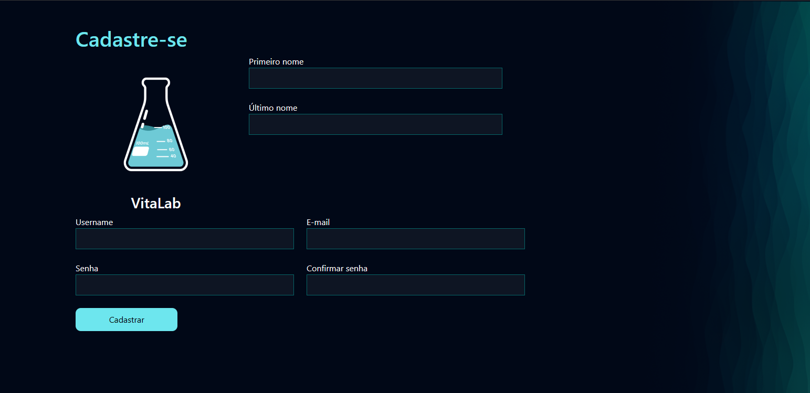

# PSW 8.0 - PYSTACKWEEK - Pythonando

## Projeto

Vitalab - Systema de gerenciamento de um laboratorio clínico.

**Cadastro**

**Login**

## Python Libs:

- django
- pillow
- weasyprint (*Requires GTK*)

## GTK for Windows
[GTK for Windows](https://github.com/tschoonj/GTK-for-Windows-Runtime-Environment-Installer/releases)
